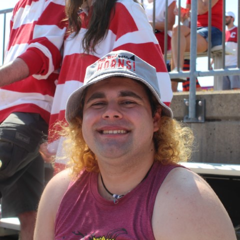

---
---

# Olive Faber -- ECE 4160: Fast Robots

## About Me

Hi, I'm Olive! I'm a senior ECE/CS major, with minors in Applied Math and Linguistics! I'm also a part of the Big Red Pep Band, where I conduct and play mellophone!

## Labs

- [Lab 1: Artemis](lab1/)
- [Lab 2: Bluetooth connection](lab2/)
- [Lab 3: TOF](lab3/)
- [Lab 4: IMU](lab4/)
- [Lab 5: Motor driver and open loop control](lab5/)
- [Lab 6: PID speed control](lab6/)
- [Lab 7: Kalman Filters (sensor fusion)](lab7/)
- [Lab 8: Stunts](lab8/)
