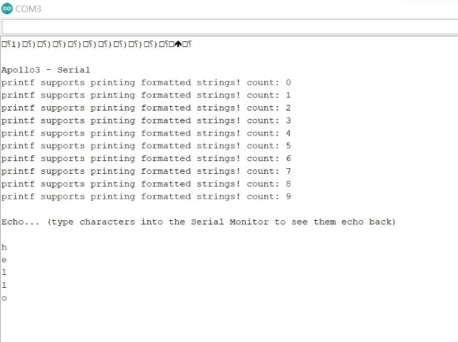
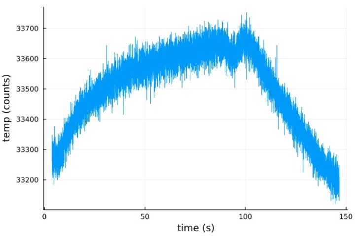
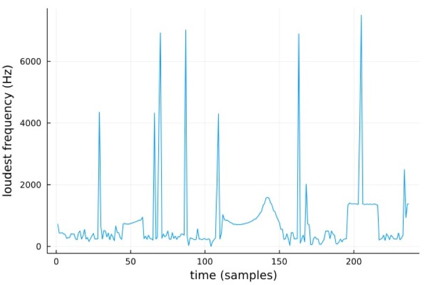

---
---

# Lab 1: The Artemis board

## Installation

I downloaded the Arduino IDE onto my computer, and installed the SparkFun board package as specified in the [setup instructions](https://learn.sparkfun.com/tutorials/artemis-development-with-arduino?_ga=2.30055167.1151850962.1594648676-1889762036.1574524297&_gac=1.19903818.1593457111.Cj0KCQjwoub3BRC6ARIsABGhnyahkG7hU2v-0bSiAeprvZ7c9v0XEKYdVHIIi_-J-m5YLdDBMc2P_goaAtA4EALw_wcB#arduino-installation).
I did have an issue where the Arduino standard library did not get installed properly, likely because I was trying to do this on midday Duffield wifi, but this was easily fixed by reinstalling the library from the libraries manager in the IDE.

When I got my lab kit, my computer was unable to detect the Artemis board when I plugged it in.
Updating my [drivers](https://learn.sparkfun.com/tutorials/how-to-install-ch340-drivers#drivers-if-you-need-them) solved this issue.
I am running Windows 11, so this should be a fun adventure :)

## Examples

### Blink

After getting my board connected and visible over serial, the Blink example worked perfectly.

<iframe width="560" height="315" src="https://www.youtube.com/embed/AwOHXO7278o" title="YouTube video player" frameborder="0" allow="accelerometer; autoplay; clipboard-write; encrypted-media; gyroscope; picture-in-picture; web-share" allowfullscreen></iframe>

### Serial

The Serial example also worked perfectly.
The first characters displayed were nonsense because the baud rate was not configured properly, but after fixing that in the dropdown menu everything worked as expected.

### Analog Read

At first I had some trouble getting the `analogRead` example to work because I thought that there was an ambient temperature sensor somewhere on the board, rather than just sensing the temperature of the board itself.
I also struggled to tell if the example was working because there was too much data output to the serial plotter and it was overlapping itself in a very hard-to-read way.
As shown in the figure below, plotted from the raw serial data using [Julia](https://julialang.org/), the data was rather noisy but did follow the expected pattern as I tried to warm up the board and then let it cool back down.
The scale of the y-axis, that is a numerical difference of a few hundred on a scale of 33,000, definitely contributed to my difficulty in determining if the sensor was working.

### Microphone Output

The `MicrophoneOutput` example also worked very well.
As shown in the figure below, plotted from the raw serial data using [Julia](https://julialang.org/), there was a lot of variability when recording just ambient room noise, but the data does reflect when I whistled next to the board with a sweeping pitch, around 50 samples and between 100 and 150 samples.

