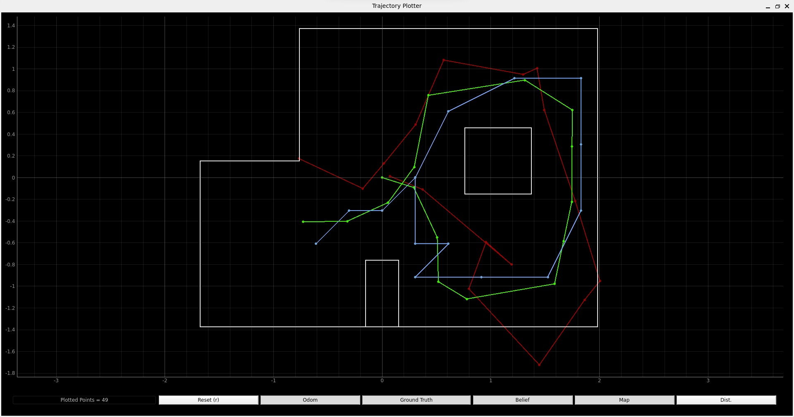
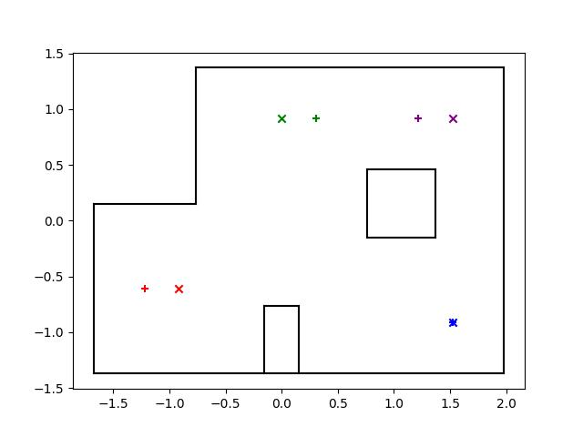

---
---

# Lab 11: Localization on the real robot

## Simulation



## Real Robot

### Code

To implement `perform_observation_loop`, I basically just copied my implementation from Lab 9:

```py
async def perform_observation_loop(self, rot_vel=120):
  calibrate_s = 1.5
  max_angle = 360.0
  delta_angle = 20.0
  tolerance = 1.0
  min_pid = tolerance
  max_pid = delta_angle + 2 * tolerance
  min_motor = 120
  max_motor = 160
  k_p = -1.0
  k_i = -0.5
  k_d = 0.0
  self.ble.send_command(CMD.JUST_MAP, f"{int(calibrate_s*1000)}|{max_angle}|{delta_angle}|{tolerance}|{min_pid}|{max_pid}|{min_motor}|{max_motor}|{k_p}|{k_i}|{k_d}")

  await asyncio.sleep(30)

  fut = ble_rx_stream(ble, 'RX_STREAM')
  self.ble.send_command(CMD.DATA_MAP, "")
  stream_map = list(unpack_stream('LfH*', await fut))

  map_data = np.array(stream_map)
  # map_time = map_data[:, 0] / 1000
  # map_angl = map_data[:, 1]
  map_dist = map_data[:, 2] / 1000

  return map_dist[::-1][np.newaxis].T, np.array([])
```

I did make this function asynchronous, and made the necessary corresponding changes in the other implementations of the same abstraction (i.e. `VirtualRobot`) and in the usages of the functions.

I made a new command, `JUST_MAP`, which does the same thing as `RUN_MAP` but without logging the PID debugging information.
This allowed me to turn the robot slower, since I didn't have to store as much data per second in the buffers.

### Poses

My localization results are shown below, with each color showing the ground truth with an `x` and the localized belief with a `+`.
The belief of the angle was plus or minus 10 degrees for every position.



The localization was quite accurate, to within about one grid cell.
The quality of the guess was about the same across locations, with about the same apparent accuracy and all with about 96% confidence.
The one exception is the bottom right position, which was much more accurate and had 100% confidence.
This may be because there is less symmetry in this location with nearby positions, due to the positioning of the obstacles.

### Videos

At the slower speed, the robot spun in place pretty well.
It turned clockwise way better than it turned counterclockwise, so I just used clockwise rotations and reversed the order of the observation list.

<iframe width="560" height="315" src="https://www.youtube.com/embed/JPO7ezCT67M" title="YouTube video player" frameborder="0" allow="accelerometer; autoplay; clipboard-write; encrypted-media; gyroscope; picture-in-picture; web-share" allowfullscreen></iframe>

<iframe width="560" height="315" src="https://www.youtube.com/embed/u0nXhQUJA3o" title="YouTube video player" frameborder="0" allow="accelerometer; autoplay; clipboard-write; encrypted-media; gyroscope; picture-in-picture; web-share" allowfullscreen></iframe>
