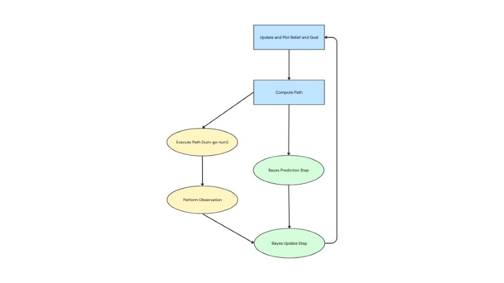

---
---

# Lab 12: Path Planning and Execution

## Spoiler Alert

None of this worked.
I ended up using an offboard neural network planning algorithm with optical input and step response output.
That is, I poked these three Jupyter cells as needed for the robot to follow the path:


But first, here's all the [cool stuff](lab12.html) I tried along the way.

## PID with Localization

I decided to do most of the planning and computation offboard since compiling Arduino programs and flashing the Artemis takes forever on my computer, which makes prototyping and debugging difficult.
This also would allow me to use the plotter to show the intermediate path planning steps.
I also could analyze (and report) the belief at each intermediate step to help debug things that went wrong.

My original plan was to compute the waypoints (including the angle needed to get to the next one), and after each turn-move-turn leg of the path, perform localization to get an estimate of the actual resulting position of the robot.
I would then plan a turn-move-turn path to the next waypoint from that new belief position, and visualize these results using the provided plotter.
My localization in Lab 11 worked quite well, so I was hoping this would make up for the fact that my PID parameters were horribly untuned.

I used the same `RealRobot` class from Lab 11 for localization, but without calibration since that would be done in advance to save time.
I had to reverse the list of sensor range values since my robot turned clockwise much better than it turned counterclockwise.

```py
async def perform_observation_loop(self, rot_vel=120):
  """Perform the observation loop behavior on the real robot, where the robot does
  a 360 degree turn in place while collecting equidistant (in the angular space) sensor
  readings, with the first sensor reading taken at the robot's current heading.
  The number of sensor readings depends on "observations_count"(=18) defined in world.yaml.

  Keyword arguments:
    rot_vel -- (Optional) Angular Velocity for loop (degrees/second)
                Do not remove this parameter from the function definition, even if you don't use it.
  Returns:
    sensor_ranges   -- A column numpy array of the range values (meters)
    sensor_bearings -- A column numpy array of the bearings at which the sensor readings were taken (degrees)
                       The bearing values are not used in the Localization module, so you may return a empty numpy array
  """

  calibrate_s = 0.0
  max_angle = 360.0
  delta_angle = 20.0
  tolerance = 1.0
  min_pid = tolerance
  max_pid = delta_angle + 2 * tolerance
  min_motor = 100
  max_motor = 140
  k_p = -1.0
  k_i = -0.5
  k_d = 0.0
  self.ble.send_command(CMD.JUST_MAP, f"{int(calibrate_s*1000)}|{max_angle}|{delta_angle}|{tolerance}|{min_pid}|{max_pid}|{min_motor}|{max_motor}|{k_p}|{k_i}|{k_d}")

  await asyncio.sleep(30)

  fut = ble_rx_stream(ble, 'RX_STREAM')
  self.ble.send_command(CMD.DATA_MAP, "")
  stream_map = list(unpack_stream('LfH*', await fut))

  map_data = np.array(stream_map)
  # map_time = map_data[:, 0] / 1000
  # map_angl = map_data[:, 1]
  map_dist = map_data[:, 2] / 1000

  return map_dist[::-1][np.newaxis].T, np.array([])
```

I then used a Bayes filter (including the prediction step) to estimate the actual resulting position of the robot, since my robot does not turn or move perfectly on target, even though I was using [PID control](#just-pid) for both drives and rotations.
I initialized the filter with a point mass distribution centered at the first waypoint (with a heading of 0°).
In an abuse of notation I considered the "ground truth" to be my current goal waypoint to make it easier to compute and visualize my results.

```py
# Run through each motion steps
for t in range(1, 9):
  print("\n\n-----------------", t, "-----------------")

  current_gt = waypoints[t,:]
  robot.set_pose(current_gt)

  # Create a turn-go-turn plan, Move the robot along the plan, and get Observation data
  plan = loc.compute_control(current_gt, current_bel)
  observation_fut = asyncio.create_task(execute_and_observe(*plan))
  await asyncio.sleep(0) # allow scheduler to run

  # Prediction Step
  loc.prediction_step(current_gt, current_bel)
  loc.print_prediction_stats(plot_data=False)

  # Update Step
  await observation_fut
  loc.update_step()
  pos_error = loc.print_update_stats(plot_data=False)
  current_bel = current_gt - pos_error
  cmdr.plot_gt(current_gt[0], current_gt[1])
  cmdr.plot_bel(current_bel[0], current_bel[1])

  print("-------------------------------------")
```

As an optimization, I separated the actual robot control commands (i.e. turning, driving, and localization mapping) into a [separate asynchronous function](https://gist.github.com/saf252/c0872ce53fbfae7908301eae0539f35c) so I could perform the two time-intensive independent operations, the robot movements and the prediction step, in parallel.


_Circles indicate time-intensive operations.
Green and blue nodes happen offboard, and yellow nodes happen onboard._

## Just PID

When I tried to run the path, I found that the robot would hang in the first localization attempt after moving, so I tried to run it with just the PID and no localization.
I was using this PID control previously, but this section is a better place to discuss it.

I added two new robot commands, `ROTATE` and `DRIVE`, which simply tried to do the specified action using orientation control or position control on a change in ToF value, respectively.

<script src="https://gist.github.com/saf252/5def1816189d2329565b43863d511258.js"></script>

For both operations, I took as input a target (expressed as a change from the current state), a tolerance, and mapping/scaling parameters from PID output values to motor input values, as well as the acutal PID gain parameters.
I made sure to use the "active stop" mode of the motor drivers after each controller to help avoid overshooting, and I had to make sure to keep units in mind -- for the distance PID, it was fine to work in millimeters and milliseconds, but for the orientation control I had to make sure to use seconds since the gyroscope reports angular speed in degrees per second.

I also modified my calibration function (and added a standalone `CALIBRATE` command) so that an input duration of 0 makes it use the previously computed mean, so I didn't need to calibrate each time I wanted to rotate but I also didn't have to fundamentally restructure the code:

```cpp
float calibrate_gyro(unsigned long duration) {
  static int count = 0;
  static float acc = 0;
  unsigned long startMillis = millis();
  while (millis() - startMillis < duration) {
    myICM.getAGMT();
    acc += myICM.gyrZ();
    ++count;
  }
  return acc / count;
}
```

### Entire Path

I first tried to run through the entire path, now pre-planned, automatically.
I simply calculated what rotations and translations were needed to get from one waypoint to the next, and ran the commands to execute those steps with the PID controllers:

```py
# Run through each motion steps
for t in range(1, 9):
  print("\n\n-----------------", t, "-----------------")

  current_gt = waypoints[t,:]
  robot.set_pose(current_gt)

  # Create a turn-go-turn plan, Move the robot along the plan, and get Observation data
  delta_rot_1, delta_trans, delta_rot_2 = loc.compute_control(current_gt, current_bel)

  # First rotation
  calibrate_s = 0.0
  delta_angle = delta_rot_1
  tolerance = 1.0
  min_pid = tolerance
  max_pid = delta_angle + 2 * tolerance
  min_motor = 100
  max_motor = 140
  k_p = 1.0
  k_i = 0.5
  k_d = 0.0
  ble.send_command(CMD.ROTATE, f"{int(calibrate_s*1000)}|{delta_angle}|{tolerance}|{min_pid}|{max_pid}|{min_motor}|{max_motor}|{k_p}|{k_i}|{k_d}")

  # Translation
  delta_distance_m = delta_trans
  tolerance_mm = 50
  min_pid = tolerance_mm
  max_pid = delta_distance_m * 1000 + 2 * tolerance_mm
  min_motor = 80
  max_motor = 100
  k_p = 1.0
  k_i = 0.0
  k_d = 0.0
  ble.send_command(CMD.DRIVE, f"{int(delta_distance_m*1000)}|{int(tolerance_mm)}|{min_pid}|{max_pid}|{min_motor}|{max_motor}|{k_p}|{k_i}|{k_d}")

  # Second rotation
  calibrate_s = 0.0
  delta_angle = delta_rot_2
  tolerance = 1.0
  min_pid = tolerance
  max_pid = delta_angle + 2 * tolerance
  min_motor = 100
  max_motor = 140
  k_p = 1.0
  k_i = 0.5
  k_d = 0.0
  ble.send_command(CMD.ROTATE, f"{int(calibrate_s*1000)}|{delta_angle}|{tolerance}|{min_pid}|{max_pid}|{min_motor}|{max_motor}|{k_p}|{k_i}|{k_d}")

  current_bel = current_gt

# Uncomment the below line to wait for keyboard input between each iteration.
  input("Press Enter to Continue")

  print("-------------------------------------")

ble.write(ble.uuid['TX_PWM_LONG'], (0).to_bytes(4, 'little'))
```

I had to make sure to manually turn off the motors after running the path to preserve the battery, since otherwise the robot would remain in an active stop state, wasting charge.

### Step by Step

I found that even without localization, my path execution would still cause the robot to hang somewhere around the second waypoint.
So, partly as a debugging measure, and partially as a last resort to use some kind of feedback control, I tried running the turn-go steps one by one:

<script src="https://gist.github.com/saf252/7db287ff76886f82bf6b2c227f3ac1bc.js"></script>

## Open Loop Control

Even step by step, the PID control just was not working.
The rotations were unreliable at best, especially when turning right the robot simply wouldn't move or would stall on completion, even with fresh batteries.
Additionally, some of the longer translations simply didn't work because the nearest wall was too far away for ToF readings with the necessary precision.
So, I tried simply using timed open loop control with my BLE characteristic that lets me manually set the motor values.
I don't think I've used this characteristic since Lab 5, but it a very helpful feature at this point.

```py
##
def send_motor(ble, fwd_1=0, bck_1=0, fwd_2=0, bck_2=0):
    return ble.write(ble.uuid['TX_PWM_LONG'], bytearray([fwd_1, bck_1, fwd_2, bck_2]))

def go_fwd(power, delay):
    send_motor(ble, power, 0, power, 0)
    time.sleep(delay)
    send_motor(ble, 0, 0, 0, 0)
def go_bck(power, delay):
    send_motor(ble, 0, power, 0, power)
    time.sleep(delay)
    send_motor(ble, 0, 0, 0, 0)
def turn_r(power, delay):
    send_motor(ble, 0, power, power, 0)
    time.sleep(delay)
    send_motor(ble, 0, 0, 0, 0)
def turn_l(power, delay):
    send_motor(ble, power, 0, 0, power)
    time.sleep(delay)
    send_motor(ble, 0, 0, 0, 0)

##
turn_l(130, 0.45)

##
go_fwd(80, 0.63)

##
turn_r(130, 0.47)
```

However, the power and timing required for accurate movement was very unreliable, and there were too many people that needed to use the maze for me to spend the time to sit down and find appropriate values for every waypoint.
I also didn't feel like this terribly academically rewarding, since we've already done open loop control and it really was just a matter of tweaking input values until it happens to work with the current battery level.

## Giving Up

So, I just ran cells that caused the robot to "go forward a bit", "turn left a bit", or "turn right a bit" as needed to complete the maze :(

<iframe width="560" height="315" src="https://www.youtube.com/embed/8ae2uuwVpEo" title="YouTube video player" frameborder="0" allow="accelerometer; autoplay; clipboard-write; encrypted-media; gyroscope; picture-in-picture; web-share" allowfullscreen></iframe>

### Going Forward

If I had more time to fix this, I have a few ideas to fix the problems I was having:

- I would implement some kind of status BLE characteristic so the robot can tell the computer when it's done executing a command.
  I had assumed the BLE system would handle this to avoid overlapping commands causing issue, and I think to some extent it does, but the fact that the same exact process works much more reliably when run as two separate Jupyter cells rather than one after the other indicates that this would definitely help.
- I would also consider using my second ToF sensor and/or driving backwards to improve the distance control PID.
  In situations where the nearest wall is too far away, I could have the robot face the other direction and use PID control going _away_ from the nearer wall.
- Relatedly, since my PID controller has trouble turning right, I could try just spinning around all the way left.
  I did briefly try this, but I found that it would wildly overshoot from the inital speed from being almost 360° away from the set point, and then either spin in circles or stall.
- That said, I do think it would help a lot to have better tuning for my PID gains.
  I picked values that worked adequately in isolation and were easy to reason about, but I need to take more time to sit down and actually calibrate proper parameters that work well on my robot.
- I might look at applying a complimentary low-pass filter to my gyroscope readings, to see if that helps with the drift better than just subtracting the mean of a sample collected at a prior time.
- If all else failed, I could just take the time to work out motor powers and timings that worked well for open loop control.
- Looking back at Lab 5, I was reminded that my robot moved better when inactive motors were given a PWM value of 1 instead of 0.
  I wonder if that would help with some of the stalling issues I had in this lab.

Thank you to all the TA's for holding extra lab hours the past few days, and for all your help trying to debug my system!
I really enjoyed this class, and as disappointed as I am to be leaving it on this note, I do hope I get to try fast robotics again sometime in my career.
