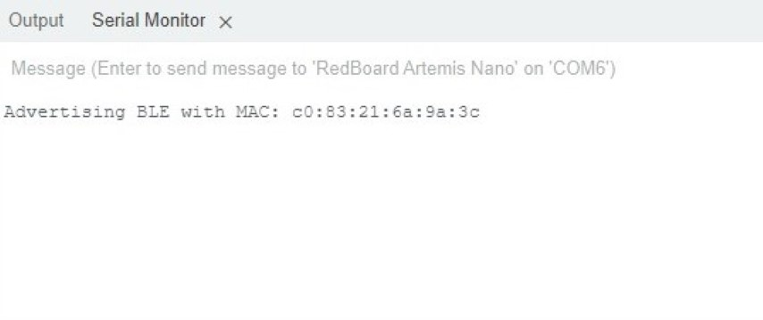
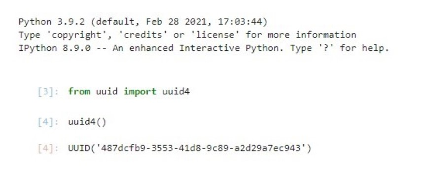
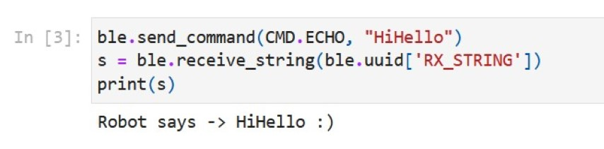
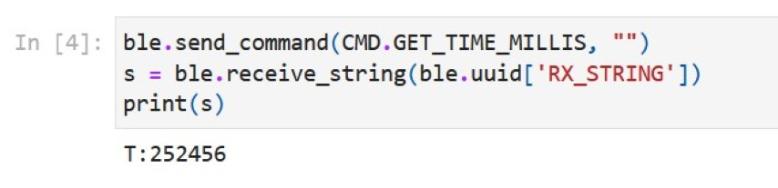
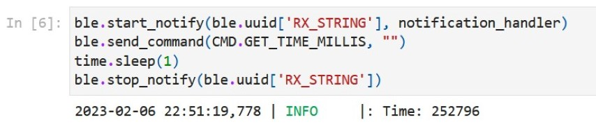
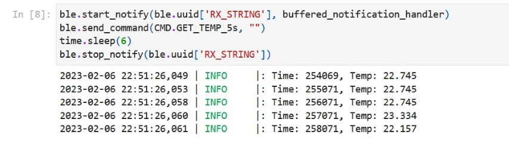
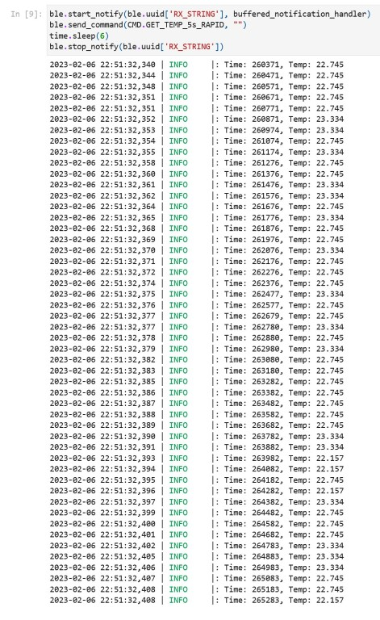

---
---

# Lab 2: Bluetooth

## Prelab

### Setup

I first [updated my Debian install in WSL2](https://technologydragonslayer.com/2022/03/15/upgrading-wsl2-debian-10-to-11/) so that Python 3.9 was available in my package repository, and then installed it via the `python3` and `python3-venv` packages.
I then created a virtual environment as described in the lab handout, except instead of creating the environment in my project folder, I instead created it in `~/pyenvs/fastrobots` to keep compiled binaries out of my git repository.
After installing the Python packages described in the lab handout, I also created a `requirements.txt` file using `pip freeze` for completeness, since the virtual environment was not part of the project repository.

Next, I installed the `ArduinoBLE` library in the IDE, and flashed the `ble_arduino.ino` sketch to the Artemis board.
It sent its MAC address over the serial port, as shown below:



I also generated a new UUID to use for the BLE service:



After this, I had to configure my WSL2 setup for Bluetooth support, which I did by following the process described in [my Ed post](https://edstem.org/us/courses/33676/discussion/2508204).
My primary resource for this was the [`usbidp-win` documentation](https://github.com/dorssel/usbipd-win/wiki/WSL-support#building-your-own-usbip-enabled-wsl-2-kernel), with a few other StackOverflow answers pointing me in the right direction about Bluetooth.
Additionally, on my own personal setup, I created the file `/etc/wsl.conf` with the contents:

```
[boot]
command="service dbus start && service bluetooth start
```

and appended the line

```bash
usbipd.exe wsl attach --distribution=Debian --busid=1-2 2>/dev/null
```

to my `.bashrc` so that the each-use setup steps happen as cleanly and automatically as possible.

I did have to manually copy my files that were to be opened in the Arduino IDE to and from a directory owned by Windows, since the IDE could not open files that existed in WSL.

### Codebase

The Arduino codebase was relatively straightforward.
`BLECStringCharacteristic.h` provides a BLE characteristic that works with C strings, as well as facilities to read and write the characteristic value with C strings.
Meanwhile, `EString.h` provides a simple wrapper to C strings that allow simple clearing, setting, and appending of a string with another string or a numeric type.
`RobotCommand.h` provides a representation of the format we use for commands to the Artemis, as well as simple iterators to get the command and its arguments.
Finally, `ble_arduino.ino` is the code that runs on the Artemis board.
It sets up the BLE service with a writeable string characteristic for receiving commands from the computer, and a float characteristic and a string characteristic for sending responses to the computer.
It contains an enum to map command numbers to human-readable names, and after connecting to a central device, every iteration through the main `loop` it handles any commands it may have received.
It also increments the value of the float characteristic by 1 every second, update twice per second and wrapping at 10,000.

The Python codebase was similarly straightforward, although it required more library knowledge to fully understand.
`utils.py` provides a class wrapping a logger to simplify logging.
`cmd_types.py` simply enumerates the commands, likewise mapping human-readable names to command numbers.
`base_ble.py` provides a generic BLE device interface that internalizes asynchronous operations and task waiting to provide a synchronous interface.
In this file, I changed line 53 to `if True:` as recommended in the lab handout.
Meanwhile, `ble.py` provides a singleton instance of a BLE controller specialized to the Artemis.
Finally, `demo.ipynb` demonstrates these various capabilities, including bluetooth connection, getting the singleton, logging, sending commands to the Artemis, and receiving values from the Artemis.

To create the Bluetooth connection, the Artemis (the peripheral device) advertises a BLE service with its MAC address and a specified UUID.
The computer (the central device) connects to the Artemis using these values, and as such is able to read and write to the characteristics the Artemis service contains.
This works by the computer sending messages to the Artemis, whether they are values written to characteristics or requests for data in characteristics, which the Artemis responds to with the requested information.

## Configurations

After reading the MAC address of my Artemis board and generating my UUID, I changed `connection.yaml` to read:

```yaml
artemis_address: "c0:83:21:6a:9a:3c"

ble_service: "487dcfb9-3553-41d8-9c89-a2d29a7ec943"
```

I also changed `ble_arduino.ino` to read:

```cpp
#define BLE_UUID_TEST_SERVICE "487dcfb9-3553-41d8-9c89-a2d29a7ec943"
```

## Demo

After getting all of the WSL2 Bluetooth configuration done, I was able to run all of the cells in the demo notebook, as shown below:

<iframe src="demo.html" height=500 width="100%"></iframe>


The only error was a `FutureWarning` in Cell 3 about a deprecated method, but this did not cause any problems and was apparently expected.

## Send Echo Command

The goal of this task was to receive a string from the computer on the Artemis, augment that string, and transmit the augmented string.
The following code was added to the `switch` statement in `ble_arduino.ino` and then flashed to the board:

```cpp
/*
 * Add a prefix and postfix to the string value extracted from the command string
 */
case ECHO:

  char char_arr[MAX_MSG_SIZE];

  // Extract the next value from the command string as a character array
  success = robot_cmd.get_next_value(char_arr);
  if (!success)
    return;

  tx_estring_value.clear();
  tx_estring_value.append("Robot says -> ");
  tx_estring_value.append(char_arr);
  tx_estring_value.append(" :)");
  tx_characteristic_string.writeValue(tx_estring_value.c_str());

  Serial.print("Sent back: ");
  Serial.println(tx_estring_value.c_str());

  break;
```

This retrieves the value set to the "receive" string characteristic into the array `char_arr`.
It then writes a prefix, the received value, and a suffix to an `EString`, the value of which it then sends over the "transmit" string characteristic.
For debugging purposes, it also sends this value over the serial port.
The following result was achieved in Jupyter:



## Get Time Command

First, I created a new command `GET_TIME_MILLIS`, so the new contents of `cmd_types.py` were:

```py
class CMD(Enum):
  PING = 0
  SEND_TWO_INTS = 1
  SEND_THREE_FLOATS = 2
  ECHO = 3
  DANCE = 4
  SET_VEL = 5
  GET_TIME_MILLIS = 6
  GET_TEMP_5s = 7
  GET_TEMP_5s_RAPID = 8
```

and in `ble_arduino.ino` I had:

```cpp
enum CommandTypes
{
  PING,
  SEND_TWO_INTS,
  SEND_THREE_FLOATS,
  ECHO,
  DANCE,
  SET_VEL,
  GET_TIME_MILLIS,
  GET_TEMP_5s,
  GET_TEMP_5s_RAPID,
};
```

I then implemented the logic in the `switch` statement in `ble_arduino.ino` and then flashed to the board:

```cpp
/*
 * Reply with a timestamp
 */
case GET_TIME_MILLIS:

  tx_estring_value.clear();
  tx_estring_value.append("T:");
  tx_estring_value.append((int) millis());
  tx_characteristic_string.writeValue(tx_estring_value.c_str());

  Serial.print("Sent back: ");
  Serial.println(tx_estring_value.c_str());

  break;
```

It then writes a prefix and the current board time (in milliseconds) to an `EString`, the value of which it then sends over the "transmit" string characteristic.
For debugging purposes, it also sends this value over the serial port.
The result of the `millis()` function needed to be explicitly casted to `int` since the compiler was upset about promotion ambiguity when trying to call `EString::append` on an `unsigned long`.
The following result was achieved in Jupyter:



## Notification Handler

I defined a notification handler function as follows:

```python
def notification_handler(sender, data):
  time = int(data[2:])
  LOG.info(f'Time: {time}')
```

The handler simply parses an integer from the byte array, ignoring the first two bytes (the "T:" prefix).
Between subscribing and unsubscribing from notifications, I let the program wait for a second to allow the notification to be received.
The following result was achieved in Jupyter:



## Get Temperature Command

First, I created new commands `GET_TEMP_5s` and `GET_TEMP_5s_RAPID`, as explained [above](#get-time-command).
I added the corresponding cases to the `switch` statement in `ble_arduino.ino`:

```cpp
/*
 * Send the die temperature in degrees Celsius once per second for 5 seconds
 */
case GET_TEMP_5s:

  get_temp_5s(1000);

  break;

/*
 * Send the die temperature in degrees Celsius ten times per second for 5 seconds
 */
case GET_TEMP_5s_RAPID:

  get_temp_5s(100);

  break;
```

I defined `check_send` in `ble_arduino.ino` to make sure that the characteristic size limit is respected:

```cpp
void check_send(EString& tx_estring_value) {
  if (tx_estring_value.get_length() >= MAX_MSG_SIZE - 50) {
    tx_characteristic_string.writeValue(tx_estring_value.c_str());
    Serial.print("Sent back: ");
    Serial.println(tx_estring_value.c_str());
    tx_estring_value.clear();
  }
}
```

This function helps manage a string characteristic sourced from an `EString` by writing the value to the characteristic (and, for debugging, to the serial port) and clearing the `EString` whenever its length gets close to (conservatively within one "append" point of) the size limit.
This allows for the `EString` to be used as a buffer for the data.
I considered writing a class to formalize this buffered stream abstraction, but decided not to for this lab.

I defined the `get_temp_5s` function in `ble_arduino.ino` as well:

```cpp
void get_temp_5s(unsigned long interval) {
  tx_estring_value.clear();
  unsigned long startMillis = millis();
  unsigned long previousMillis = startMillis - interval;
  unsigned long currentMillis = startMillis;
  while (currentMillis - startMillis < 5000) {
    if (currentMillis - previousMillis >= interval) {
      check_send(tx_estring_value);
      tx_estring_value.append("|T:");
      tx_estring_value.append((int) currentMillis);
      check_send(tx_estring_value);
      tx_estring_value.append("|C:");
      tx_estring_value.append(getTempDegC());
      previousMillis = currentMillis;
    }
    currentMillis = millis();
  }
  tx_estring_value.append("|E");
  tx_characteristic_string.writeValue(tx_estring_value.c_str());
  Serial.print("Sent back: ");
  Serial.println(tx_estring_value.c_str());
}
```

This uses `tx_estring_value` as a buffer, as described above.
At regular intervals up to 5 seconds, it writes time/temperature pairs to the buffer, allowing it to send and clear if necessary.
When it is done, it appends the special symbol `E` to the data so that the receiver knows the stream is done, as explained below.
It then flushes whatever may be left in the buffer to the characteristic and to the serial port.

In Python, the process was reversed.
I created a global data buffer that the notification handler wrote to, and then processed when the end stream symbol was encountered:

```python
data_buffer = ''
def buffered_notification_handler(sender, data):
  global data_buffer
  data = ble.bytearray_to_string(data)
  data_buffer += data
  if data[-1] == 'E':
    data = data_buffer[1:-2].split('|')
    data_buffer = ''
    for time, temp in zip(data[0::2], data[1::2]):
      time = int(time[2:])
      temp = float(temp[2:])
      LOG.info(f'Time: {time}, Temp: {temp}')
```

In addition to managing the stream buffer, once the stream is finished the handler parses the data by splitting on the divider character (ignoring the first spurious `|` and the steam end token `|E`) and parsing pairs of values as time/temperature pairs.

This worked for multiple timestamped temperatures:



as well as for many (50) timestamped temperatures:



## Limitations

5 seconds of 16-bit values at 150Hz is about 1.5 kB of data.
Using the full RAM of the Artemis, this means that 256 sets of data can be stored before running out of memory.
However, some RAM must also be available for program variables, so the board can actually only store 255 sets of data realistically, or conservatively about 250.
