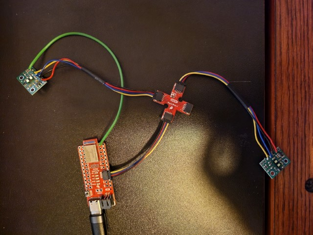

---
---

# Lab 3: Time of Flight Sensors

## Prelab

According to the datasheet, the default I2C address for the ToF sensor is `0x52` for writing and `0x53` for reading.

I plan to change the address of one sensor programamtically to use two sensors, since it requires fewer wires and less soldering, leaving more flexibility to place the sensors far apart on the robot.
It also means that the distance sensors can be sampled at a higher rate, since they work simultaneously and there is no startup/shutdown overhead.

I had originally planned to mount the two sensors on the front of the car angled away from each other, however that would severely limit the field of view and require much more complicated math.
I also discovered that it could cause the two sensors to interfere with each other and give inaccurate readings.
Instead, I plan to mount one sensor on the front of the car and the other on one side, since this gives another dimension of perception (as opposed to mounting the second sensor on the back).
The robot may obviously miss obstacles behind it or on the side without a sensor, and it may also have a blind spot between the two sensors depending on how they are mounted.


The `XSHUT` pin of one of the ToF sensors is connected to Pin 8 of the Artemis, and the `SDA` and `SCL` pins are connected to the proper color from the Qwiic specification.

## Lab Tasks

I soldered the long cables to the sensors to allow maximum flexibility with where they will be placed on the robot.
I also attached the green wire to the Artemis by wrapping it around the edge instead of soldering it, as this connection is temporary since I don't know yet if Pin 8 will be required for something else.
I soldered the wires so they came out the front of the sensor to allow it to lie flush against a surface.
For the first few tasks, the sensor with the green wire was disconnected from the breakout board.



I first ran the I2C example to scan for devices on the bus, with the following results:


As expected, the scan found one device on the main I2C bus and none on the secondary bus.
However, the address found was `0x29`, not `0x52` as was expected.
`0x29` is `0x52` shifted right by one bit, so the scan is likely reporting I2C addresses without the read/write bit.

I decided to use short range, since it is the most resistant to ambient light and I don't expect the robot's test environment to be much larger than 1.3 meters.
For the two sensor setup, I may use the front-mounted sensor in long range and the side-mounted sensor in short range, or vice-versa, depending on the actual environment.
To test the range, I modified the distance sensor example sketch to use short range mode, and I simply pointed the sensor at the wall and stepped backwards until it was giving erroneous readings:


The last distance measured before a reading of `0` was 2.166m, and the largest reading taken was 2.281m.
Both of these values are notably larger than the nominal range of 1.3m (shown with a red dotted line), so the accuracy may be questionable.

To test the accuracy, repeatability, and ranging time, I further modified the example sketch to print the time each ranging operation took in microseconds, as well as the current board time in milliseconds with each reading.
My experimental setup consisted of the distance sensor taped against my laptop which was set up at 90 degrees to the floor, and I marked increments of 30cm to the wall:


I moved my laptop to each mark and left it there for about a minute.
I recorded the serial port using [PuTTY](https://www.chiark.greenend.org.uk/~sgtatham/putty/) since it was way too much data to screenshot or copy from the Arduino serial monitor, and I created my plots using Matplotlib from a console in Jupyter Lab.
I also uesd Dill to store my Jupyter sessions between work times so I didn't have to reimport and reparse my input each time.
The distance data recorded was promising (the measured distances are shown with red dotted lines):


I computed accuracy by averaging the distance values over the constant regions of the graph, and repeatability by taking the standard deviation of averages of 32-sample partitions of the constant regions of the graph.
There is a systematic error of about -2cm in the measurements, which may be an acutal systematic error in the sensor but it is also entirely possible that my measurements were a bit off, especially since I had to project from the bottom of the refrigerator door to the floor to get my zero point.

| Distance |    Average |  Accuracy | Repeatability |
| -------: | ---------: | --------: | ------------: |
|  1200 mm | 1179.82 mm | -20.18 mm |        0.1994 |
|   900 mm |  883.24 mm | -16.77 mm |        0.2053 |
|   600 mm |  581.06 mm | -18.94 mm |        0.2107 |
|   300 mm |  267.52 mm | -32.48 mm |        0.2555 |

The ranging time averaged about 50000 microseconds, plus or minus (mostly plus) about 1000 microseconds.

The two sensors were hooked up as shown [above](#lab-tasks).
I further modified the example code to support two sensors, by changing the `setup` as shown below:

<script src="https://gist.github.com/saf252/0bfb4e5c81ea133a39f6e095c94449d3.js"></script>

I had to `digitalWrite` the shutdown pin instead of using `distanceSensor2.sensorOff()` and `distanceSensor2.sensorOn()` for some reason, probably related to the fact that the distance sensors were global variables so the constructor ran at a weird time.
I also had to set the I2C address both before and after initializing the sensor, otherwise it would stop working until I fully unplugged everything.
I think this is because the initialization happens over I2C, so the driver needed the address set before, but the initialization resets the address so it needed to be changed again after.
I chose to use address `0x32` because other addresses weren't working, and [Anya said it worked last year](https://anyafp.github.io/ece4960/labs/lab3/).
The two sensors do work in parallel, as shown in the serial monitor in the video:

<iframe width="560" height="315" src="https://www.youtube.com/embed/OMHw8R1Rmps" title="YouTube video player" frameborder="0" allow="accelerometer; autoplay; clipboard-write; encrypted-media; gyroscope; picture-in-picture; web-share" allowfullscreen></iframe>

To run the two sensors as fast as possible, I moved the `startRanging()` calls to the `setup` and used the following `loop`:

<script src="https://gist.github.com/saf252/76e794f323536873dbb16359b1d59ee8.js"></script>

The loop generally executes about every 4 ms, although when a sensor is ready that loop iteration takes about 8 ms.
The limiting factor is probably the data polling and serial printing.

Finally, I set up the data to send over Bluetooth.
I designed my own streaming protocol to transfer messages larger than 150 bytes efficiently.
In short, messages are sent in 149-byte chunks, where the first byte of the message is a "packet index" to help catch any reordered or dropped packets.
Once this byte is `0`, the transmission is finished.
In Python, I wrote a [receiver](https://gist.github.com/saf252/b3f56915fbaac618f69b1db46e79bff3), which does have some errors with actually receiving a message in multiple packets.
This wasn't a problem in this lab since the messages never actually exceeded 150 bytes, and I fixed it for the next lab.
I used `struct.unpack` format strings to parse out the data from the stream.
For the Artemis, I wrote a [buffered polymorphic characteristic](https://gist.github.com/saf252/f6234287b4931f00844461ad21dd7dd7) as a transmitter.
The transmitter requires a reference to a `BLECharacteristic` with `BLENotify` enabled, for which I generated a new UUID:

```cpp
BLECharacteristic tx_characteristic_stream(BLE_UUID_TX_STREAM, BLERead | BLENotify, MAX_MSG_SIZE);
BLETxStream tx_stream(&tx_characteristic_stream);
```

To actually record the data, I modified the Command enums and `ble_arduino.ino` `switch` as in [Lab 2](../lab2/#get-temperature-command), defining:

<script src="https://gist.github.com/saf252/164c7567f0b18aa7fd53abb51420f7e2.js"></script>

To differentiate the sensors, I inverted the bits of the timestamps for Sensor 2, so there was no need to assume or enforce that the sensors would be perfectly collated in the datastream.

<script src="https://gist.github.com/saf252/9b0dba594acd4ad1e219c899905fd787.js"></script>

I set up the two sensors pointing at objects with different but similar distances so that the readings would be distinct, but the variations and noise would be visible:


