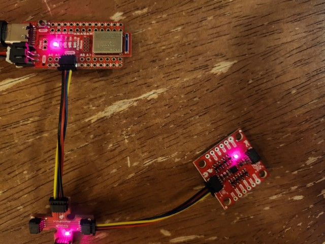
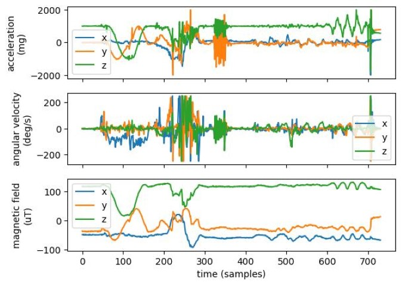
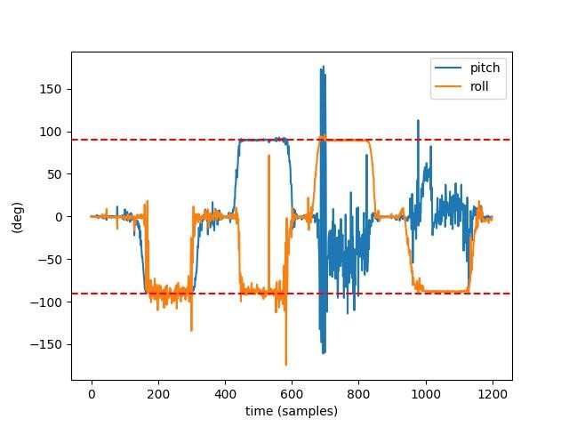
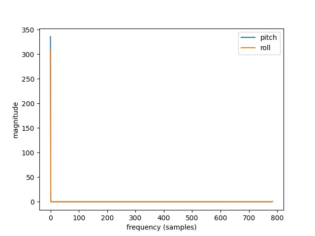
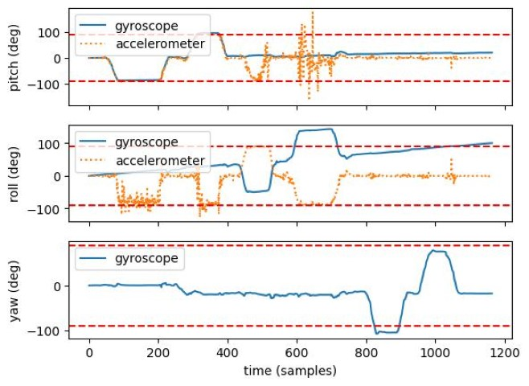
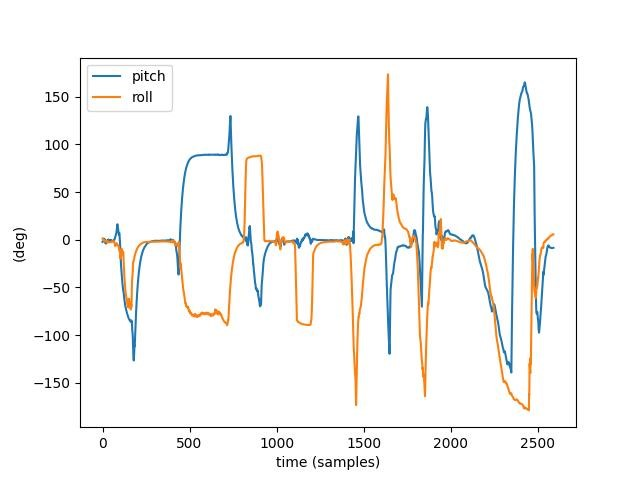
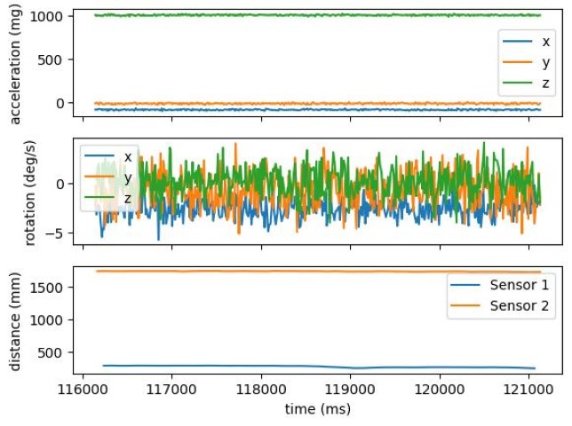
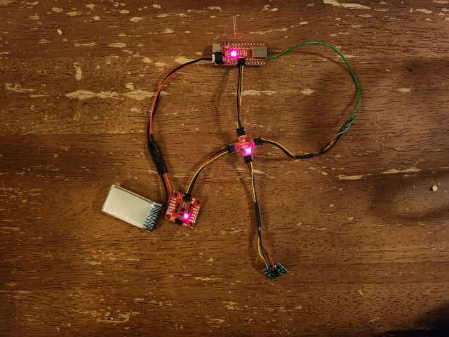
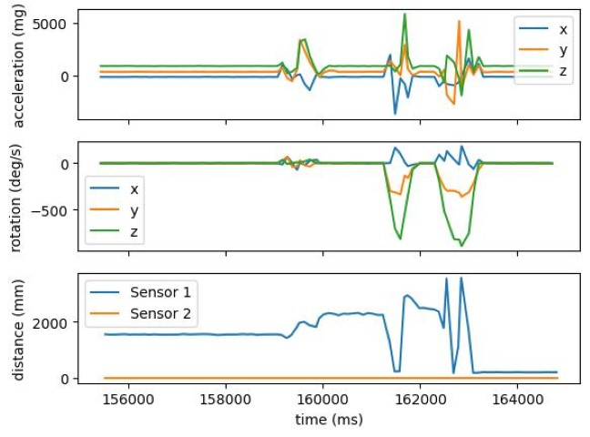

---
---

# Lab 4: IMU

## Set up the IMU

I simply connected the IMU to the QWIIC breakout board.



I ran the IMU example code, and the results were about as expected.
For the accelerometer, the value of gravity shifted between components as I rotated the IMU, and the `x` acceleration became negative and then positive and then back to zero when I moved the IMU in the `x` direction.
Likewise, the gyroscope readings spiked when I rotated the IMU, and the magnetometer readings seem to correspond with orientation to some extent.



The temperature did not change significantly over the course of data collection, hovering around 27.6 degrees (room temperature).

`AD0_VAL` is the value of the last bit of the IMU's I2C address.
Since the address select jumpter on the back of the board is not closed, the value is `1`.

## Accelerometer

I calculated pitch with $$\theta = \arctan\left( \frac{a_x}{a_z} \right) \times \frac{180°}{\pi}$$ and roll with $$\phi = \arctan\left( \frac{a_y}{a_z} \right) \times \frac{180°}{\pi}$$, i.e.

```cpp
pitch = atan2(sensor.accX, sensor.accZ) * 180 / M_PI;
roll = atan2(sensor.accY, sensor.accZ) * 180 / M_PI;
```

For the experiment, I started with the IMU flat, and then tilted it 90° in pitch, then back, then the other way in pitch, then back, then 90° in roll, then back, then the other way in roll, then back.



The accelerometer is reasonably accurate, apparently giving ±90° (indicated with dotted red lines) for pitch and roll as appropriate, and tracking the transitions between flat and ±90° (roll is not well-defined at ±90° pitch, and vice versa).

I collected data from the accelerometer while running the car right next to it:



The axes in this plot are nearly meaningless in terms of units, but it doesn't matter because the plot does show that there is no high-frequency noise component.
This likely means the built-in LPF in the IMU unit is enabled by default.
Which is convenient.
If it weren't, I would have chosen a cutoff frequency $$f_c$$ and computed $$RC = \frac{1}{2\pi f_c}$$, so

$$\alpha = \frac{T}{T + RC} = \frac{1}{1 + f_s RC} = \frac{2\pi f_c}{2\pi f_c + f_s}$$

where $$f_s$$ is the sample frequency.

## Gyroscope

For the experiment, I started with the IMU flat, and then tilted it 90° in pitch, then back, then the other way in pitch, then back, then 90° in roll, then back, then the other way in roll, then back, then I twisted it 90° in yaw, then back, then the other way in yaw, then back.

For pitch and roll, the gyroscope data was less subject to small fluctuations than the accelerometer data (especially for roll when pitch is ±90° and vice versa), the weird polarity issue with roll notwithstanding.
However, the gyroscope data is much more susceptible to drift.
There is no other reference for yaw, but the same observations seem to hold.
The dotted red lines still indicate ±90°.



I ran the same experiment after implementing the complimentary filter:

```cpp
const double alpha = 0.05;
unsigned long previousTime = 0;
double previousPitch;
double previousRoll;
double previousYaw;

void printFiltPitchRoll(ICM_20948_I2C &sensor)
{
  unsigned long currentTime = millis();
  double accpitch = atan2(sensor.accX(), sensor.accZ()) * 180 / M_PI;
  double accroll = atan2(sensor.accY(), sensor.accZ()) * 180 / M_PI;
  double gyrpitch;
  double gyrroll;
  if (previousTime == 0) {
    gyrpitch = accpitch;
    gyrroll = accroll;
  } else {
    double dt = currentTime - previousTime;
    dt /= 1000;
    gyrpitch = (previousPitch + sensor.gyrY() * dt) * (1 - alpha) + accpitch * alpha;
    gyrroll = (previousRoll + sensor.gyrX() * dt) * (1 - alpha) + accroll * alpha;
  }
  previousTime = currentTime;
  previousPitch = gyrpitch;
  previousRoll = gyrroll;
```

I chose $$\alpha = 0.05$$ somewhat arbitrarily, just because that's normally a good value for things like this.
It corresponds to $$f_c \approx 21\,\mathrm{Hz}$$.
For this experiment I just turned the IMU 360° around and back in pitch and then in yaw, and then flicked and shook the IMU.



The complimentary filter does indeed avoid both drift and floating, however its reading lags pretty far behind the actual position of the IMU, and it can't handle transitioning between 180° and -180°.
This first problem may be solvable with a different choice of $$\alpha$$.

## Sample Data

As in Lab 3, I wrote a function to handle the command and sample the IMU as fast as possible, storing the results in a buffer.

```cpp
void get_imu_time(unsigned long duration)
{
  unsigned long startMillis = millis();
  unsigned long currentMillis = millis();
  while (currentMillis - startMillis < duration)
  {
    if (myICM.dataReady())
    {
      myICM.getAGMT();
      imu_buf[imu_buf_len++] = *(float *) &currentMillis;
      imu_buf[imu_buf_len++] = myICM.accX();
      imu_buf[imu_buf_len++] = myICM.accY();
      imu_buf[imu_buf_len++] = myICM.accZ();
      imu_buf[imu_buf_len++] = myICM.gyrX();
      imu_buf[imu_buf_len++] = myICM.gyrY();
      imu_buf[imu_buf_len++] = myICM.gyrZ();
    }
    currentMillis = millis();
  }
  tx_stream.write(imu_buf, imu_buf_len);
  imu_buf_len = 0;
  tx_stream.flush();
}
```

`imu_buf` is a `float` array initially allocated to fill most of the available memory on the board so I could record data and determine an appropriate buffer size.
The weird pointer cast on line 10 was to put the `unsigned long` timestamp directly into the buffer, so the buffer could be simply written to the stream.
This works well because `long`s and `float`s are both 4 bytes wide.

To receive the data over Bluetooth, I used the new API defined by my [fixed receiver](https://gist.github.com/saf252/96d5ba3c10475b55cccc1978582d223d), which registers a notification handler to receive the stream and eventually writes the data to a `Future`.

<script src="https://gist.github.com/saf252/89b2085cdaaf8d79d02fa91bb180f196.js"></script>

The general paradigm for receiving a stream is run the first cell to register the `Future` and send the command to the Artemis, and run the second cell until the `Future` is done.
This allows the `Future`s to be "awaited" without having to depend on `asyncio`, and registering the `Future` first helps ensure that no stream packets are missed.

By taking the mean of the differences between adjacent timestamps, I determined that the IMU was sampled about once every 8 ms.
This is considerably faster than the ToF sensors, which were measured in Lab 3 to sample about once every 50 ms.
Therefore, for this task of sampling as fast as possible, it makes the most sense to have separate buffers for the IMU readings and for each ToF reading.
By having separate buffers, there is no requirement or expectation for readings to be arranged any particular way in the buffer, and they don't have to be tagged like in Lab 3.

The board has about 348 kB available before creating the buffers.
The IMU needs 28 bytes per sample (1 `long` timestamp and 6 `float` readings), and each ToF needs 6 bytes per sample (1 `long` timestamp and 1 `short` reading).
The IMU samples about every 8 ms, and the ToF samples about every 50 ms, so for even seconds, I need space for about 6 times as many IMU samples as for each ToF sensor.
So, for every ~50 ms, I have (2 × 6 + 6 × 28 =) 180 bytes, or about 3600 bytes (3.6 kB) per second.
I can allot about 8-9 seconds while leaving enough room for local variables.
I chose to make enough buffer space for 8 seconds, which means 960 IMU samples and 160 samples of each ToF.

```cpp
float imu_buf[7 * 960];
size_t imu_buf_len = 0;

unsigned long tof1_time_buf[160];
uint16_t tof1_data_buf[160];
size_t tof1_buf_len = 0;

unsigned long tof2_time_buf[160];
uint16_t tof2_data_buf[160];
size_t tof2_buf_len = 0;
```

I am still embedding the IMU timestamps in the buffer, although the ToF's have a separate buffer for timestamps because `long`s and `int16_t`s have different bitwidths.
To record the data, I simply dump it into the buffers when it becomes available:

```cpp
void buf_all_time(unsigned long duration)
{
  uint16_t distance;
  distanceSensor1.startRanging();
  distanceSensor2.startRanging();
  unsigned long startMillis = millis();
  unsigned long currentMillis = millis();
  while (currentMillis - startMillis < duration)
  {
    if (myICM.dataReady())
    {
      myICM.getAGMT();
      imu_buf[imu_buf_len++] = *(float *) &currentMillis;
      imu_buf[imu_buf_len++] = myICM.accX();
      imu_buf[imu_buf_len++] = myICM.accY();
      imu_buf[imu_buf_len++] = myICM.accZ();
      imu_buf[imu_buf_len++] = myICM.gyrX();
      imu_buf[imu_buf_len++] = myICM.gyrY();
      imu_buf[imu_buf_len++] = myICM.gyrZ();
    }
    if (distanceSensor1.checkForDataReady())
    {
      distance = distanceSensor1.getDistance();
      distanceSensor1.clearInterrupt();
      tof1_time_buf[tof1_buf_len] = currentMillis;
      tof1_data_buf[tof1_buf_len] = distance;
      ++tof1_buf_len;
    }
    if (distanceSensor2.checkForDataReady())
    {
      distance = distanceSensor2.getDistance();
      distanceSensor2.clearInterrupt();
      tof2_time_buf[tof2_buf_len] = currentMillis;
      tof2_data_buf[tof2_buf_len] = distance;
      ++tof2_buf_len;
    }
    currentMillis = millis();
  }
  distanceSensor1.stopRanging();
  distanceSensor2.stopRanging();
}
```

To retrieve the data from the buffers, I added new commands to dump each buffer into the stream:

```cpp
/*
 * Send timestamped IMU data from the buffer
 * The data is sent as: [timestamp, accX, accY, accZ, gyrX, gyrY, gyrZ]
 */
case GET_IMU_BUF:
  tx_stream.write(imu_buf, imu_buf_len);
  imu_buf_len = 0;
  tx_stream.flush();
  break;

/*
 * Send timestamped ToF data from the buffer for the sensor specified in the command (1 or 2)
 * The data is sent as: [timestamp, distance]
 */
case GET_TOF_BUF:
  int sensor;
  success = robot_cmd.get_next_value(sensor);
  if (!success)
    return;
  if (sensor == 1)
  {
    for (size_t i = 0; i < tof1_buf_len; ++i)
    {
      tx_stream.write(tof1_time_buf[i]);
      tx_stream.write(tof1_data_buf[i]);
    }
    tof1_buf_len = 0;
  }
  else if (sensor == 2)
  {
    for (size_t i = 0; i < tof2_buf_len; ++i)
    {
      tx_stream.write(tof2_time_buf[i]);
      tx_stream.write(tof2_data_buf[i]);
    }
    tof2_buf_len = 0;
  }
  tx_stream.flush();
  break;
```

The data is rather boring because the IMU was just sitting on my desk when I did this, but I was indeed able to store and send 5 seconds of data:



## Cut the Cord

We are using the battery with more capacity to drive the motors because running the motors uses far more energy than powering the control electronics and sensors, so by using the bigger battery for the motors we get slightly better runtime between charges.



## Record a Stunt

Due to timing constraints, I had to experiment with the car in my living room rather than in Phillips.

<iframe width="560" height="315" src="https://www.youtube.com/embed/QIxIKsMQzQ4" title="YouTube video player" frameborder="0" allow="accelerometer; autoplay; clipboard-write; encrypted-media; gyroscope; picture-in-picture; web-share" allowfullscreen></iframe>

I noticed that the car can spin in place quite quickly, and when driven in the opposite direction it is currently driving it will typically flip.
When no inputs are given, it does not seem to apply any particularly strong braking force.
It tends to drift to one side when driving forward or backward.

I mounted my second ToF sensor to the top of the car rather than the side, because with only tape to attach components, it was difficult to get it on the side of the car without getting in the way of the wheels.
I still have not permanently attached the shutdown pin of my ToF sensor to the Artemis, which severely limited the intensity of stunts I was able to record.
I set the accelerometer and gyroscope to their maximum ranges, and still was only able to record a short burst forward and a small spin without crashing the program by dislodging the ToF shutdown wire.



To record the stunt, instead of fully buffering data, I instead just directly streamed it synchronously, producing a simple `l6flHlH*` format:

```cpp
// inside `void loop()`
// Collect IMU data
if (recording) {
  while (!myICM.dataReady());
  tx_stream.write(millis());
  myICM.getAGMT();
  tx_stream.write(myICM.accX());
  tx_stream.write(myICM.accY());
  tx_stream.write(myICM.accZ());
  tx_stream.write(myICM.gyrX());
  tx_stream.write(myICM.gyrY());
  tx_stream.write(myICM.gyrZ());
  while (!distanceSensor1.checkForDataReady());
  tx_stream.write(millis());
  tx_stream.write(distanceSensor1.getDistance());
  distanceSensor1.clearInterrupt();
  while (!distanceSensor2.checkForDataReady());
  tx_stream.write(millis());
  tx_stream.write(distanceSensor2.getDistance());
  distanceSensor2.clearInterrupt();
}
```
