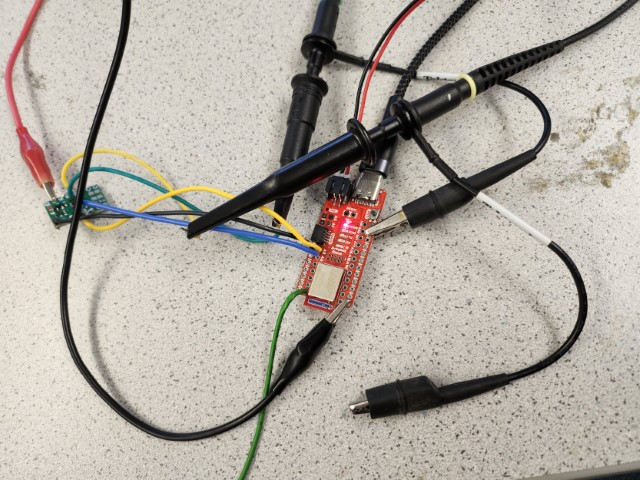

---
---

# Lab 5: Motors and Open Loop Control

## Prelab

### Connections


I used pins `A2` and `A3` to control one motor driver, and `A15` and `A14` to control the other.
These pins were placed nicely next to each other on the board, and all support PWM.

### Batteries

The Artemis and motors are powered from separate batteries for a number of reasons.
One is simply that more batteries means more capacity, i.e. longer time between charges.
More importantly, however, powering the Artemis and motors from separate batteries helps insulate the Artemis from EMI and flyback current from the motors.

## Motor Driver Bench Test



I used the oscilloscope probes to measure the current on the paired `OUT1` and `OUT2` nodes.
I set the power supply to 3.7 volts since that is the nominal voltage of the batteries we are using, and I set the current limit to 3 amps since according to the datasheet, each channel of the motor driver can handle 1.5 amps.
In the image above, the power supply alligator clips are connected to the `VIN` pin on the motor driver and to a ground pin on the Artemis, since the `GND` pin on the motor driver was too close to the `VIN` pin to easily set up without short circuiting.

To test the motor drivers, I simply used a 4-byte BLE characteristic, and when the characteristic was written to, I use each byte as the argument to `analogWrite` for one of the motor pins:

```cpp
BLEUnsignedLongCharacteristic rx_characteristic_pwm(BLE_UUID_RX_PWM, BLEWrite);
// ...
void pwmCharacteristicWritten(BLEDevice central, BLECharacteristic rx_characteristic) {
  const uint8_t* bytes = rx_characteristic.value();
  analogWrite(MOTOR1_FWD, bytes[0]);
  analogWrite(MOTOR1_BCK, bytes[1]);
  analogWrite(MOTOR2_FWD, bytes[2]);
  analogWrite(MOTOR2_BCK, bytes[3]);
  Serial.print("PWM: ");
  Serial.println(*(const unsigned long*) bytes, HEX);
}
// ...
rx_characteristic_pwm.setEventHandler(BLEWritten, pwmCharacteristicWritten);
```

<script src="https://gist.github.com/saf252/6f244ac1d5f4e7647761ed9935e27677.js"></script>

which gave the following results (the yellow channel is `OUT1` and the blue channel is `OUT2`):

|         |            `OUT1`, 0             |            0., `OUT2`            |
| ------: | :------------------------------: | :------------------------------: |
|  **50** |   |   |
| **100** |  |  |
| **150** |  |  |
| **200** |  |  |

I used the same Arduino code after connecting the wheels, driven cell-by-cell in Jupyter as:

```py
##
send_motor(ble, 100, 10)
##
send_motor(ble, 0, 0)
##
send_motor(ble, 10, 100)
```

I found that it didn't work when I used 0 for one value, so I just used a small number instead.
I also found that it caused problems when I switched directions without stopping, hence the write in the middle.

<iframe width="563" height="1001" src="https://www.youtube.com/embed/PMBiud_fvgw" title="Lab 5 | Wheels Spinning on the Bench" frameborder="0" allow="accelerometer; autoplay; clipboard-write; encrypted-media; gyroscope; picture-in-picture; web-share" allowfullscreen></iframe>

## Assembly

<iframe width="560" height="315" src="https://www.youtube.com/embed/ue718MOBG-g" title="YouTube video player" frameborder="0" allow="accelerometer; autoplay; clipboard-write; encrypted-media; gyroscope; picture-in-picture; web-share" allowfullscreen></iframe>

Despite driving both motors "forwards" (`send_motor(ble, 100, 10, 100, 10)`), the left and right wheels spun in opposite directions.
I [later](#calibration) determined that my left motor driver pins were backwards, and addressed the issue.


For space and positioning reasons, I connected the QWIIC port on the Artemis directly to the IMU, and the breakout board is connected to the other QWIIC port of the IMU.
For now, the components are held together with packing tape, since it is all I had on hand.
I plan to attach things with hot glue when I get a chance, since it will be more secure without getting in the way of the sensors.

## Calibration

To safely run the robot, I added a new Robot Command, `DRIVE`, to run the specified PWM values for a fixed amount of time:

```cpp
case DRIVE:
  success = robot_cmd.get_next_value(duration)
    && robot_cmd.get_next_value(ival1)
    && robot_cmd.get_next_value(ival2)
    && robot_cmd.get_next_value(ival3)
    && robot_cmd.get_next_value(ival4)
  ;
  if (!success) return;
  analogWrite(MOTOR1_FWD, ival1);
  analogWrite(MOTOR1_BCK, ival2);
  analogWrite(MOTOR2_FWD, ival3);
  analogWrite(MOTOR2_BCK, ival4);
  delay(duration);
  analogWrite(MOTOR1_FWD, 0);
  analogWrite(MOTOR1_BCK, 0);
  analogWrite(MOTOR2_FWD, 0);
  analogWrite(MOTOR2_BCK, 0);
  break;
```

I also switched the pins for the right motor (`A14` forward, `A15` backward) to align the directions with the left motor.
I determined the lower limit in PWM value for moving forward and turning using this command, changing the values until the robot reliably moved:

```py
##
mag_l = 60
mag_r = mag_l
ble.send_command(CMD.DRIVE, f"1000|{mag_l}|1|{mag_r}|1")
##
mag_l = 150
mag_r = mag_l
ble.send_command(CMD.DRIVE, f"500|1|{mag_l}|{mag_r}|1")
```

I determined the lower limit for moving forward to be about 60, but for on-axis turns the lower limit was as high as 150.

To calibrate the robot, I similarly guessed and checked values until I got the robot to move in a generally straight line, for 6 feet:

```py
##
duration = 900
mag_l = 138
mag_r = 100
time.sleep(5)
ble.send_command(CMD.DRIVE, f"{duration}|{mag_l}|1|{mag_r}|1")
```

I wanted to test this in Phillips, but I ran out of time with the storm.

<iframe width="560" height="315" src="https://www.youtube.com/embed/Sv959BzdmSg" title="YouTube video player" frameborder="0" allow="accelerometer; autoplay; clipboard-write; encrypted-media; gyroscope; picture-in-picture; web-share" allowfullscreen></iframe>

## Open Loop Control

I determined the parameters for the path I wanted again by guessing and checking:

<script src="https://gist.github.com/saf252/3600c69b744e7425879642b7a3431dae.js"></script>

I wanted to run the path using the `DRIVE` command, but the BLE kept disconnecting, so instead I transcribed it into a new Robot Command:

```cpp
case OPEN_LOOP:
  analogWrite(MOTOR1_FWD, 138);
  analogWrite(MOTOR1_BCK, 1);
  analogWrite(MOTOR2_FWD, 100);
  analogWrite(MOTOR2_BCK, 1);
  delay(600);
  analogWrite(MOTOR1_FWD, 1);
  analogWrite(MOTOR1_BCK, 238);
  analogWrite(MOTOR2_FWD, 200);
  analogWrite(MOTOR2_BCK, 1);
  delay(250);
  analogWrite(MOTOR1_FWD, 138);
  analogWrite(MOTOR1_BCK, 1);
  analogWrite(MOTOR2_FWD, 100);
  analogWrite(MOTOR2_BCK, 1);
  delay(400);
  analogWrite(MOTOR1_FWD, 238);
  analogWrite(MOTOR1_BCK, 1);
  analogWrite(MOTOR2_FWD, 1);
  analogWrite(MOTOR2_BCK, 200);
  delay(250);
  analogWrite(MOTOR1_FWD, 138);
  analogWrite(MOTOR1_BCK, 1);
  analogWrite(MOTOR2_FWD, 100);
  analogWrite(MOTOR2_BCK, 1);
  delay(600);
  analogWrite(MOTOR1_FWD, 0);
  analogWrite(MOTOR1_BCK, 0);
  analogWrite(MOTOR2_FWD, 0);
  analogWrite(MOTOR2_BCK, 0);
  break;
```

The path was intended to go straight, turn left, go straight, turn right, and go straight.
It did indeed do this, but the turns were definitely not the right angles I was trying for.

<iframe width="560" height="315" src="https://www.youtube.com/embed/ziy7DUpL5tE" title="YouTube video player" frameborder="0" allow="accelerometer; autoplay; clipboard-write; encrypted-media; gyroscope; picture-in-picture; web-share" allowfullscreen></iframe>
