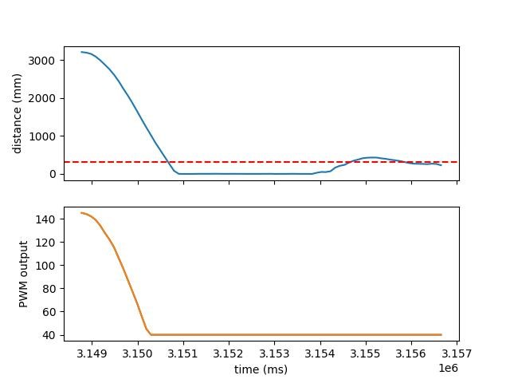
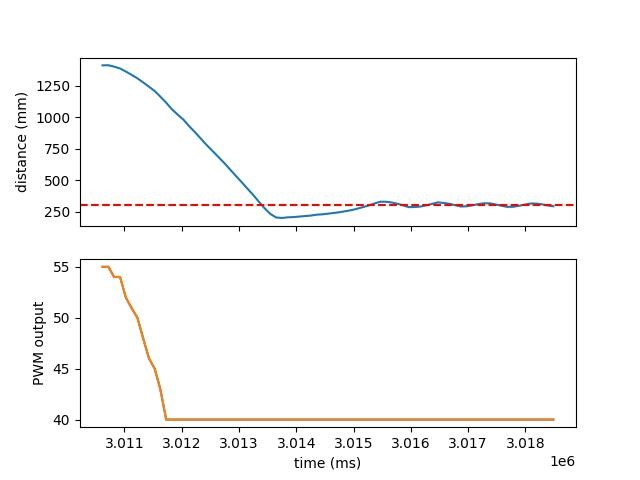
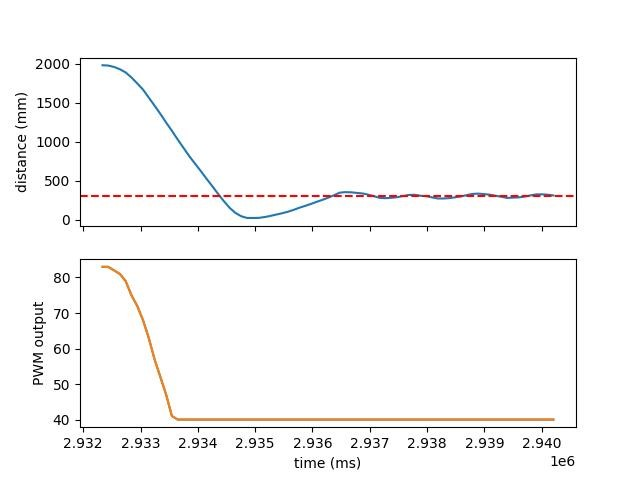

---
---

# Lab 6: Closed-loop control (PID)

## Prelab

For this lab, I am sending and receiving data over Bluetooth the same way I did in [Lab 4](../lab4/#sample-data).
I store the data into buffers as it is collected, and I have a separate command to receive it using my stream protocol.
The Python code for this is simpler than before, as I realized that `await` _just works_ in Jupyter notebooks:

```py
##
fut = ble_rx_stream(ble, 'RX_STREAM')
ble.send_command(CMD.DATA_PID, "")
stream_data = list(unpack_stream('LHfBB*', await fut))
```

## Lab Task

I chose to do Task A.
I began with a simple P controller, since it is the easiest to work with.
I chose `K_p = 0.05` since it maps the range of ToF sensor values nicely onto the range `[0..255]` (i.e. $$0.05 \cdot 4000 = 200$$), and it turned out to be a good value for getting decent speed without crashing into the wall too hard.

I set up a generic PID control system so I could supply the various parameters without reflashing the board:

<script src="https://gist.github.com/saf252/20666cd29fa1775a3de825f2132d5f14.js"></script>

And in Python, I could run the controller using:

```py
##
time.sleep(5)
timeout_s = 8
target_ft = 1
deadband = 40
calibration = 1
K_p = -0.05
K_i = 0
K_d = 0
ble.send_command(CMD.RUN_PID, f"{int(timeout_s*1000)}|{int(target_ft*304)}|{deadband}|{calibration}|{K_p}|{K_i}|{K_d}")
time.sleep(timeout_s)
```

I added a timeout parameter for safety, and used the `deadband` and `calibration` (`= rightMotorPWM / leftMotorPWM`) values I determined in Lab 5.
I ended up not needing the calibration factor, as the car ran relatively straight.
I also made `K_p` negative since the car was driving in the wrong direction, and inverting it here was easier than reflashing the board with corrected direction control.

I ran the PID controller three times, with different starting distances.
I put a pillow against the wall to help avoid damage if (when) the car crashed into the wall.
I also was having trouble with the distance sensor at first, it seems it was pointed on a slight angle so from most distances, it was reading the floor instead of the wall.
Flipping the car over solved this issue for now.

In all of the trials, the car generally reached and then oscillated around the set point.
This is because I set a minimum motor drive value outside the deadband, and no actual braking once it reached the point.
This could be altered in the future but for now, it serves as a good proof of concept.

In the figures, the set point is shown with the dashed line.
The PWM output to the motors is reported as the "absolute value" since the direction is not taken into account.

### Run 1

<iframe width="560" height="315" src="https://www.youtube.com/embed/OhYD01OzkrE" title="YouTube video player" frameborder="0" allow="accelerometer; autoplay; clipboard-write; encrypted-media; gyroscope; picture-in-picture; web-share" allowfullscreen></iframe>



### Run 2

<iframe width="560" height="315" src="https://www.youtube.com/embed/j9AaYHHRfYw" title="YouTube video player" frameborder="0" allow="accelerometer; autoplay; clipboard-write; encrypted-media; gyroscope; picture-in-picture; web-share" allowfullscreen></iframe>



### Run 3

<iframe width="560" height="315" src="https://www.youtube.com/embed/8WhlJKpv9vE" title="YouTube video player" frameborder="0" allow="accelerometer; autoplay; clipboard-write; encrypted-media; gyroscope; picture-in-picture; web-share" allowfullscreen></iframe>


