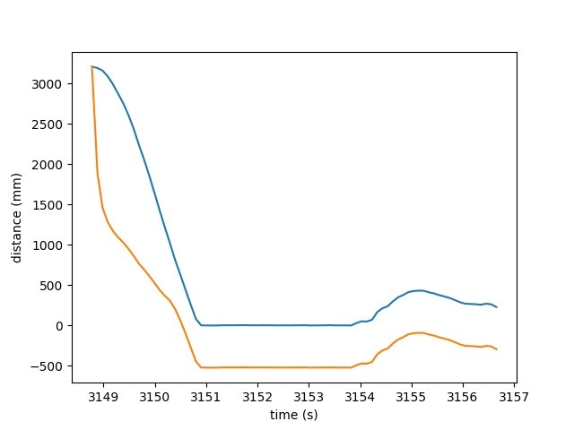

---
---

# Lab 7: Kalman Filter

## Testing in Jupyter

I chose my step size to be 160, a close upper bound of the PWM values produced in Lab 6.

I was sick and also very busy this week so I did not have time to do this lab properly, so I am using [Anya's results](https://anyafp.github.io/ece4960/labs/lab7/) for the drag and momentum values with my Lab 6 results.

<script src="https://gist.github.com/saf252/076c5b34bbfcf7425047faf5c22d2c2a.js"></script>

I plotted the KF estimated position (in orange) against my measured position from lab (in blue):



The filter consistently underestimates the measured data, but this is probably because I am not using the correct tuning parameters (drag and mass) for my particular car, as the shape of both curves are similar.

## Extrapolation

I still did not have time to actually run this lab, but I planned to implement simple linear extrapolation:

```cpp
void run_pid(unsigned long timeout, unsigned short goal, uint8_t deadband, float calibration, float k_p, float k_i, float k_d) {
  PID params = { (float) goal, k_p, k_i, k_d };
  unsigned long startMillis, currentMillis;
  unsigned long previousMillis;
  uint16_t previousDistance;
  distanceSensor1.startRanging();
  startMillis = millis();
  do {
    currentMillis = millis();
    uint16_t distance;
    if (distanceSensor1.checkForDataReady()) {
      distance = distanceSensor1.getDistance();
      distanceSensor1.clearInterrupt();

      currentSpeed = (distance - previousDistance) / (currentMillis - previousMillis);
      previousDistance = distance;
      previousMillis = currentMillis;

      tof1_time_buf[tof1_buf_len] = currentMillis;
      tof1_data_buf[tof1_buf_len] = distance;
      ++tof1_buf_len;
    } else {
      distance = previousDistance + currentSpeed * (currentMillis - previousMillis);

      tof2_time_buf[tof2_buf_len] = currentMillis;
      tof2_data_buf[tof2_buf_len] = distance;
      ++tof2_buf_len;
    }

      // Compute PID
      float raw = pid(currentMillis, distance, params, !tof1_buf_len);
      uint8_t left = constrain(abs(raw), deadband, 255);
      uint8_t right = constrain(abs(raw) * calibration, deadband, 255);

      // Scale PID for motors
      if (raw > 0) {
        analogWrite(MOTOR1_FWD, left);
        analogWrite(MOTOR2_FWD, right);
        analogWrite(MOTOR1_BCK, 0);
        analogWrite(MOTOR2_BCK, 0);
      } else {
        analogWrite(MOTOR1_FWD, 0);
        analogWrite(MOTOR2_FWD, 0);
        analogWrite(MOTOR1_BCK, left);
        analogWrite(MOTOR2_BCK, right);
      }
    }
  } while (currentMillis - startMillis < timeout);
  analogWrite(MOTOR1_FWD, 0);
  analogWrite(MOTOR2_FWD, 0);
  analogWrite(MOTOR1_BCK, 0);
  analogWrite(MOTOR2_BCK, 0);
  distanceSensor1.stopRanging();
}
```
