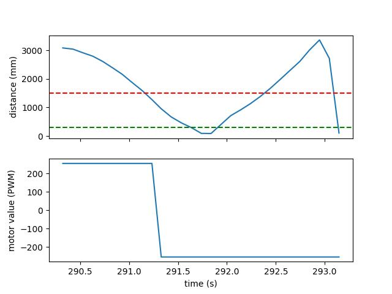
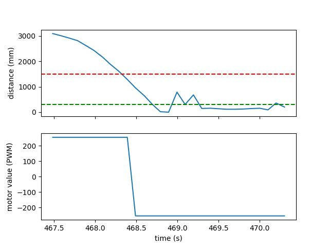
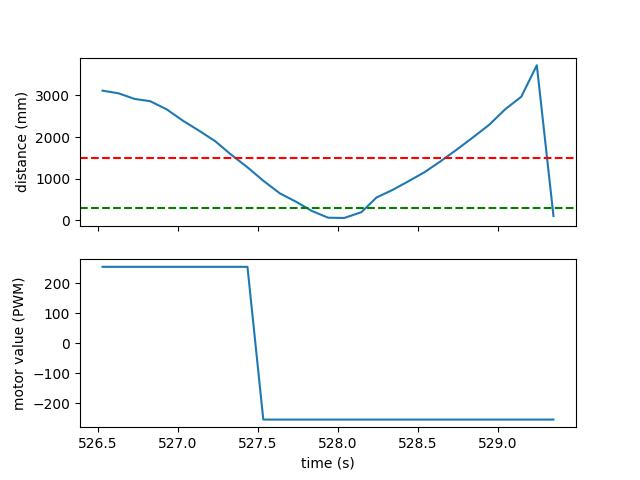

---
---

# Lab 8: Stunts!

I chose to complete Task A: position control.

## Setup

I separated the task running and data transmitting into separate Robot Commands, as in previous labs.
I disengaged my PID control and did not use a Kalman Filter, so the code on the Artemis was pretty straightforward:

```cpp
void run_stunt(unsigned long timeout, unsigned short target, uint8_t power_l, uint8_t power_r) {
  unsigned long startMillis, currentMillis;
  unsigned long duration;
  distanceSensor1.startRanging();

  // Forward
  analogWrite(MOTOR1_FWD, power_l);
  analogWrite(MOTOR2_FWD, power_r);
  analogWrite(MOTOR1_BCK, 0);
  analogWrite(MOTOR2_BCK, 0);
  startMillis = millis();
  do {
    currentMillis = millis();
    if (distanceSensor1.checkForDataReady()) {
      uint16_t distance = distanceSensor1.getDistance();
      distanceSensor1.clearInterrupt();

      // Store data in buffer, using tof2 data for motor values
      tof1_time_buf[tof1_buf_len] = currentMillis;
      tof1_data_buf[tof1_buf_len] = distance;
      tof2_data_buf[tof1_buf_len] = (int16_t) power_l;
      ++tof1_buf_len;

      // Do the stunt at the target
      if (distance <= target && distance > 0) {
        duration = currentMillis - startMillis;
        break;
      }
    }
  } while (currentMillis - startMillis < timeout);

  // Backward
  analogWrite(MOTOR1_FWD, 0);
  analogWrite(MOTOR2_FWD, 0);
  analogWrite(MOTOR1_BCK, power_l);
  analogWrite(MOTOR2_BCK, power_r);
  startMillis = millis();
  do {
    currentMillis = millis();
    if (distanceSensor1.checkForDataReady()) {
      uint16_t distance = distanceSensor1.getDistance();
      distanceSensor1.clearInterrupt();

      // Store data in buffer, using tof2 data for motor values
      tof1_time_buf[tof1_buf_len] = currentMillis;
      tof1_data_buf[tof1_buf_len] = distance;
      tof2_data_buf[tof1_buf_len] = -(int16_t) power_l;
      ++tof1_buf_len;
    }
  } while (currentMillis - startMillis < duration);

  analogWrite(MOTOR1_FWD, 0);
  analogWrite(MOTOR2_FWD, 0);
  analogWrite(MOTOR1_BCK, 0);
  analogWrite(MOTOR2_BCK, 0);
  distanceSensor1.stopRanging();
}
```

and I could run the stunt and collect the ToF and PWM data from Jupyter with

```py
##
time.sleep(5)
timeout_s = 10
target_m = 1.5
power_l = 255
power_r = power_l
ble.send_command(CMD.RUN_STUNT, f"{int(timeout_s*1000)}|{int(target_m*1000)}|{power_l}|{power_r}")
time.sleep(timeout_s)
##
fut = ble_rx_stream(ble, 'RX_STREAM')
ble.send_command(CMD.DATA_STUNT, "")
stream_data = list(unpack_stream('LHh*', await fut))
```

## Stunts

Below are videos of my stunts, and graphs of the ToF data recorded and motor output generated during each one.
In the ToF graphs, the green dotted line indicates the goal 0.5 meters from the wall, and the red dotted line indicates the target actually given to the robot in order to get it to not crash.
I was unable to get the robot to actually flip over without completely losing orientation.

### Run 1

<iframe width="419" height="745" src="https://www.youtube.com/embed/aHaMR9fzc_E" title="Lab 8 | Run 1" frameborder="0" allow="accelerometer; autoplay; clipboard-write; encrypted-media; gyroscope; picture-in-picture; web-share" allowfullscreen></iframe>



### Run 2

<iframe width="419" height="745" src="https://www.youtube.com/embed/dzNqlOF97A4" title="Lab 8 | Run 2" frameborder="0" allow="accelerometer; autoplay; clipboard-write; encrypted-media; gyroscope; picture-in-picture; web-share" allowfullscreen></iframe>



### Run 3

<iframe width="419" height="745" src="https://www.youtube.com/embed/gIHTj6zB7io" title="Lab 8 | Run 3" frameborder="0" allow="accelerometer; autoplay; clipboard-write; encrypted-media; gyroscope; picture-in-picture; web-share" allowfullscreen></iframe>


