---
---

# Lab 9: Mapping

## Control

I chose to use PID orientation control for this lab, aiming for 20° increments.
I've been having trouble getting my robot to do anything slowly, so I wanted to be able to stop and take ToF measurements.
I added a gyroscope calibration element of subtracting the mean of a set of samples taken before starting, since I was finding that the controller was drastically overshooting its target while thinking it was accurate.
It still overshoots, but much less now, and it is much more consistent in how it does overshoot (relevant later).

I also had to rotate the robot slightly faster than I would have liked, since the memory of the Artemis limited the amount of PID data I could store to plot later so the rotation had to complete relatively quickly.

### Code

```cpp
float calibrate_gyro(unsigned long duration) {
  int count = 0;
  float acc = 0;
  unsigned long startMillis = millis();
  while (millis() - startMillis < duration) {
    myICM.getAGMT();
    acc += myICM.gyrZ();
    ++count;
  }
  return acc / count;
}

void run_map(unsigned long calibrateDuration, float maxAngle, float deltaAngle, float tol, float minRange, float maxRange, uint8_t minPower, uint8_t maxPower, float k_p, float k_i, float k_d) {
  float calibration = calibrate_gyro(calibrateDuration);

  unsigned long previousMillis, currentMillis;
  float currentAngle = 0;
  while (abs(currentAngle) <= abs(maxAngle)) {
    // Take a measurement
    distanceSensor1.startOneshotRanging();
    while (!distanceSensor1.checkForDataReady())
      delay(1);
    currentMillis = millis();
    uint16_t distance = distanceSensor1.getDistance();

    tof1_time_buf[tof1_buf_len] = currentMillis;
    tof2_time_buf[tof1_buf_len] = *(unsigned long*) &currentAngle;
    tof1_data_buf[tof1_buf_len] = distance;
    ++tof1_buf_len;

    // Rotate
    float targetAngle = currentAngle + deltaAngle;
    float integrator = 0;
    previousMillis = currentMillis;
    myICM.getAGMT();
    while (abs(currentAngle - targetAngle) > tol) {
      float dt = (currentMillis - previousMillis) / 1000.0;
      float speed = myICM.gyrZ() - calibration;
      currentAngle += speed * dt;

      float error = currentAngle - targetAngle;
      integrator += error * dt;
      float pid = k_p * error + k_i * integrator + k_d * speed;

      uint8_t motor = (abs(pid) - minRange) * (maxPower - minPower) / (maxRange - minRange) + minPower;
      if (pid < 0) {
        motorWrite(motor, 0, 0, motor);
      } else {
        motorWrite(0, motor, motor, 0);
      }


      uint32_t motor_pad = motor;
      imu_buf[imu_buf_len++] = *(float*) &currentMillis;
      imu_buf[imu_buf_len++] = speed;
      imu_buf[imu_buf_len++] = currentAngle;
      imu_buf[imu_buf_len++] = error;
      imu_buf[imu_buf_len++] = integrator;
      imu_buf[imu_buf_len++] = pid;
      imu_buf[imu_buf_len++] = motor_pad;

      previousMillis = currentMillis;
      myICM.getAGMT();
      currentMillis = millis();
    }

    motorWrite(255, 255, 255, 255);
  }
  motorWrite(0, 0, 0, 0);
}
```

I ran the experiments from Jupyter as usual:

```py
##
calibrate_s = 1.5
max_angle = 360.0
delta_angle = 20.0
tolerance = 1.0
min_pid = tolerance
max_pid = delta_angle + 2 * tolerance
min_motor = 120
max_motor = 180
k_p = -1.0
k_i = -0.5
k_d = 0.0
ble.send_command(CMD.RUN_MAP, f"{int(calibrate_s*1000)}|{max_angle}|{delta_angle}|{tolerance}|{min_pid}|{max_pid}|{min_motor}|{max_motor}|{k_p}|{k_i}|{k_d}")

##
fut = ble_rx_stream(ble, 'RX_STREAM')
ble.send_command(CMD.DATA_MAP, "")
stream_map = list(unpack_stream('LfH*', await fut))

##
fut = ble_rx_stream(ble, 'RX_STREAM')
ble.send_command(CMD.PID_MAP, "")
stream_pid = list(unpack_stream('LfffffL*', await fut))
```

### PID

The PID controller generally behaved as it was supposed to, with the motor output (and correspondingly rotation speed) rising and falling as the integrated angle stepped towards 360°.

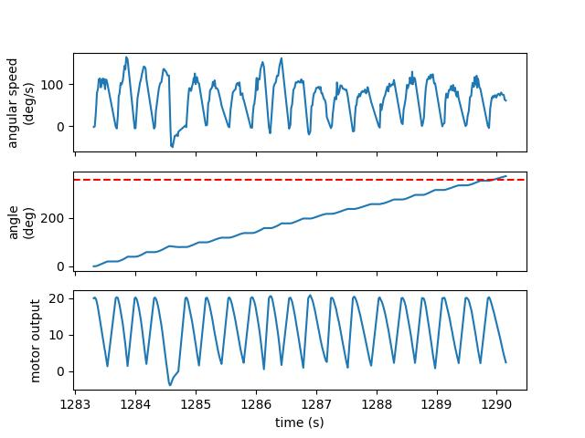

The robot turned pretty well on axis, although sometimes it was far better than others.
The trials with significant drift seem to be the outliers, so I am happy with how it turns.

<iframe width="419" height="745" src="https://www.youtube.com/embed/VyCNO2J3iD0" title="Lab 9 | Spinning in Place" frameborder="0" allow="accelerometer; autoplay; clipboard-write; encrypted-media; gyroscope; picture-in-picture; web-share" allowfullscreen></iframe>

Despite the success of the actual PID controller and the on-axis turns of the robot, I had issues with drift in the gyroscope.
The robot consistently overshot 360° by about one to two entire 20° steps, but the integrated angle was very close to 360°.
Since this error was relatively consistent it was possible to rescale the output angles to compensate for it, the average error of a map created in an empty square room may be small, but the maximum error would be significant since the gyroscope consistently underestimates the actual rotational speed of the robot.

## Data

I measured the distances using the ToF sensor on the front of my robot.
As mentioned previously, the integrated gyroscope values underestimate the actual angle of the robot, but the error was consistent enough that assuming the readings were spaced equally in angular space provided decent data.

### Polar Plots

I plotted the raw data from the mapping, as well as the data scaled in angular space to reflect reality.
I determined the scale factors by guessing from the observed final orientation of the robot compared to the final angle reading, and from there fine-tuned them by tweaking the values until the polar plots looked reasonable.

```py
@widgets.interact(scale=(1.0, 1.5, 0.01))
def do_polar_plot(scale=1.25):
    plt.polar(np.radians(map_angl * scale), map_dist)
```

| Position |                 Raw Plot                 |                 Scaled Plot                 | Scale Factor |
| :------: | :--------------------------------------: | :-----------------------------------------: | :----------: |
|  (0, 0)  |   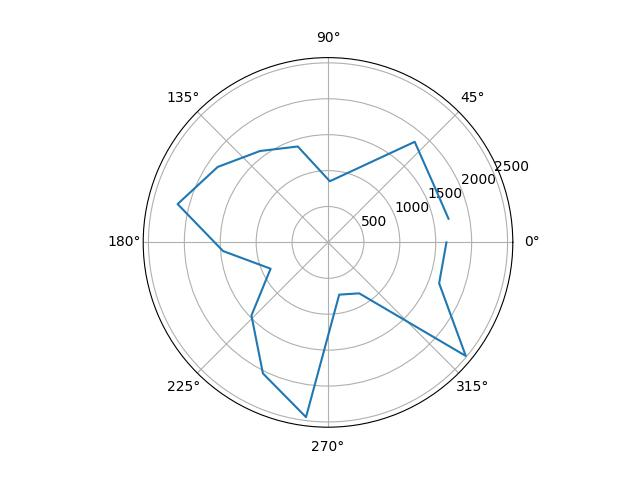   |   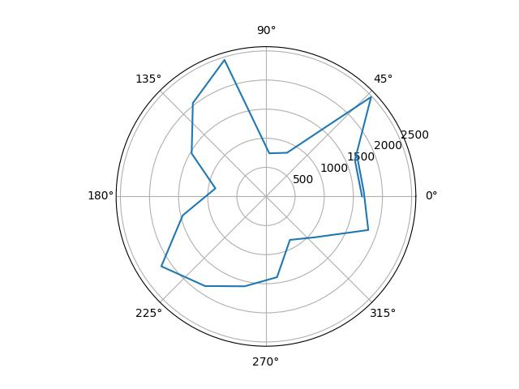   |     1.10     |
|  (5, 3)  |   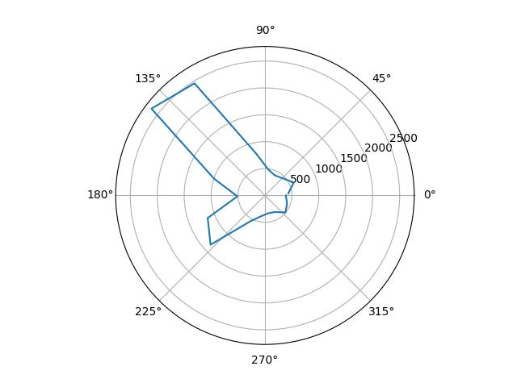   |   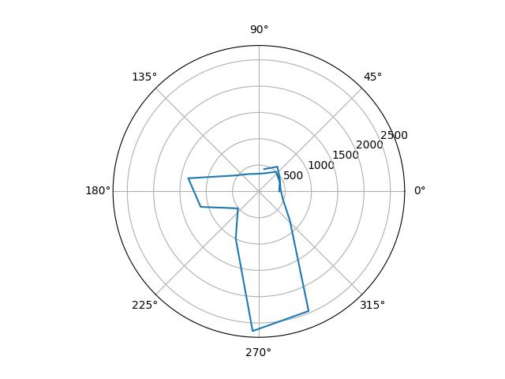   |     1.23     |
| (5, -3)  |  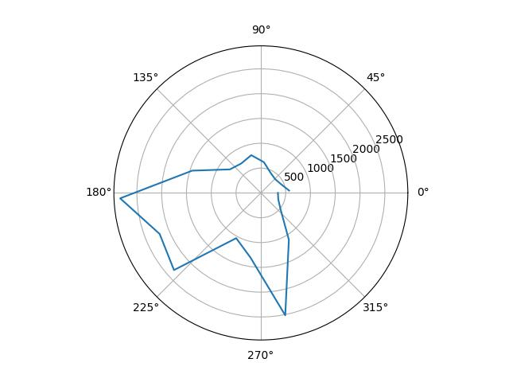  |  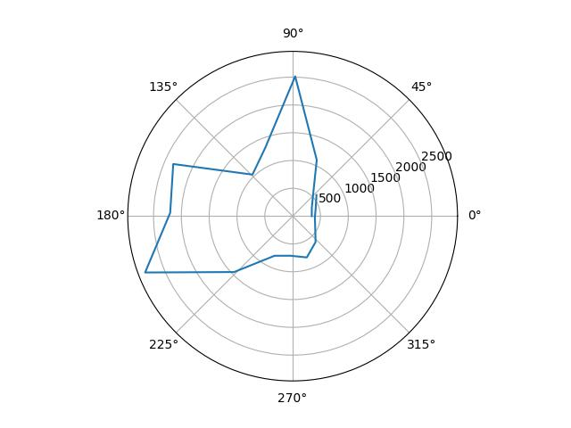  |     1.13     |
|  (0, 3)  |   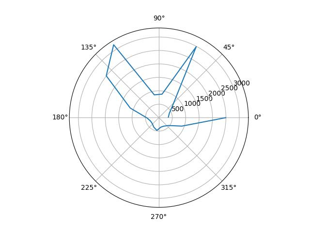   |   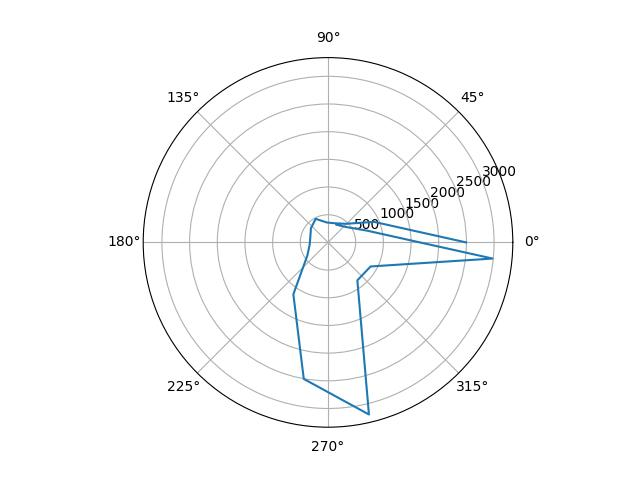   |     1.19     |
| (-3, -2) | 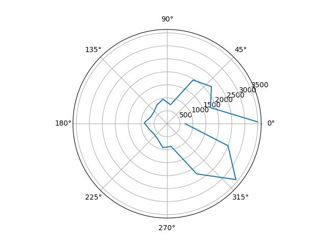 | 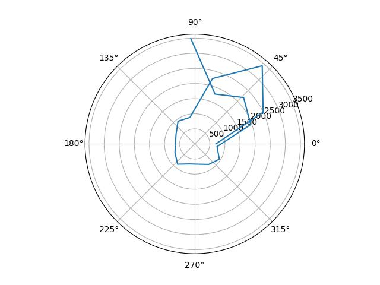 |     1.26     |

### Merged Plot

I used straightforward transformation matrices making the simplifying assumption that the space is flat (i.e. two-dimensional) and that the distance between the center of the robot and ToF sensor was negligible, giving:

$$\begin{bmatrix} x \\ y \end{bmatrix} = \begin{bmatrix} x_0 + r \cos(\theta) \\ y_0 + r \sin(\theta) \end{bmatrix}$$

where $$r$$ is the distance measurement in millimeters, $$\theta$$ is the angle measurement in radians, and $$(x_0, y_0)$$ is the location where the reading was taken in millimeters.

I tried to determine apparent walls from my data, shown below, and while I was able to get a general (admittedly wonky) shape of the room, I struggled to identify any consistent boundaries for the obstacles.
It is clear where they are from the polar plots, but there is not enough consistency to deduce many acutal boundaries.
This may also be because my ToF sensor is mounted pointing slightly upwards, so distances may be a bit off, but that doesn't seem to adequately explain the magnitude of the error here.

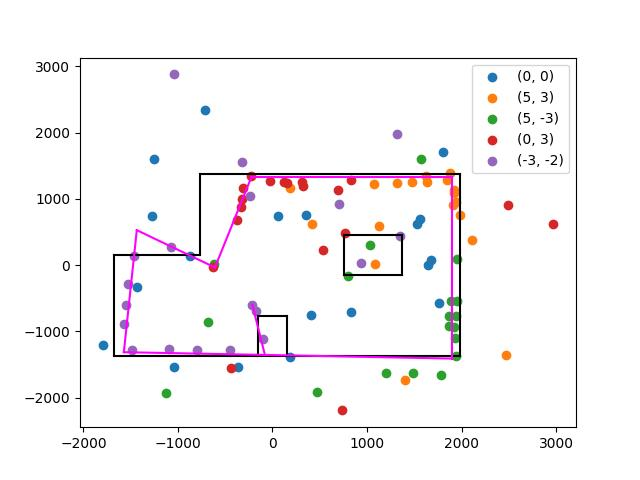
